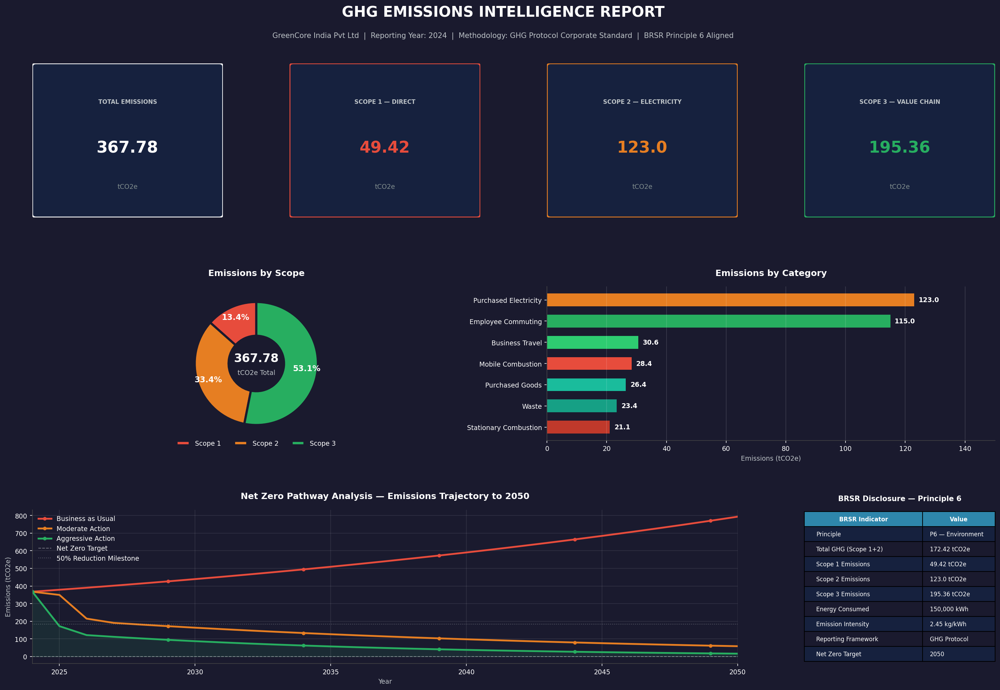

# GHG Emissions Intelligence Calculator
### Scope 1, 2 & 3 | GHG Protocol Aligned | BRSR Principle 6 | Net Zero Scenario Modelling


Interactive Power BI Dashboard: See GHG_Dashboard.pbit for the full interactive dashboard export with scenario filtering and BRSR disclosure table.
---

## Overview

An end-to-end **Greenhouse Gas (GHG) Emissions Calculator** built in Python, designed for Indian companies navigating mandatory sustainability disclosure requirements. The calculator takes company activity data as input, applies authoritative emission factors, and produces a board-ready emissions intelligence report with Net Zero pathway modelling.

This tool addresses a critical gap in the Indian market — enterprise GHG accounting software (Watershed, Persefoni, Salesforce Net Zero Cloud) costs hundreds of thousands of dollars annually, placing it out of reach for small and mid-size companies. This calculator delivers equivalent analytical output as an open-source, India-specific, BRSR-aligned tool.

---

## What It Does

| Feature | Description |
|--------|-------------|
| **Scope 1 Emissions** | Stationary combustion (diesel, petrol, natural gas, LPG, coal) and mobile combustion (company fleet) |
| **Scope 2 Emissions** | Purchased electricity using India-specific CEA grid emission factor (0.82 kg CO2e/kWh) |
| **Scope 3 Emissions** | Business travel, employee commuting, waste disposal, and purchased goods |
| **Net Zero Modelling** | Three-scenario trajectory analysis (Business as Usual, Moderate Action, Aggressive Action) to 2050 |
| **Intervention Analysis** | Quantified impact of specific reduction interventions (renewable energy, EV fleet, remote work, waste reduction) |
| **BRSR Disclosure Table** | Structured output aligned to SEBI BRSR Principle 6 — Environment for direct use in annual reporting |
| **Intelligence Dashboard** | Single-page visual report combining all outputs — designed for board-level presentation |

---

## Regulatory Context

This calculator is designed around two primary compliance frameworks:

**GHG Protocol Corporate Standard**
The internationally recognised methodology for corporate greenhouse gas accounting. Defines the Scope 1/2/3 framework and calculation approach used throughout this tool.

**BRSR — Business Responsibility and Sustainability Reporting**
Mandatory for India's top 1000 listed companies (SEBI circular, FY2022-23 onwards). Principle 6 requires disclosure of Scope 1 and Scope 2 emissions, energy consumption, and emission intensity. This calculator generates BRSR-ready output directly.

---

## Emission Factor Sources

All emission factors are sourced from authoritative, publicly available databases:

| Source | Coverage | Version |
|--------|----------|---------|
| **GHG Protocol** | Scope 1 — stationary and mobile combustion | 2024 |
| **Central Electricity Authority (CEA) India** | Scope 2 — India grid electricity (0.82 kg CO2e/kWh) | 2024 |
| **UK DEFRA** | Scope 3 — business travel, commuting, waste | 2024 |
| **EXIOBASE** | Scope 3 — purchased goods (supply chain) | 2024 |

The emission factor database is structured as a modular CSV — when factors are updated annually, only the database file needs updating. The calculation engine requires no changes.

---

## Methodology

### Calculation Logic
```
Emissions (kg CO2e) = Activity Data (quantity) × Emission Factor (kg CO2e per unit)
Emissions (tCO2e) = Emissions (kg CO2e) / 1000
```

### Scope Definitions
- **Scope 1** — Direct emissions from sources owned or controlled by the company
- **Scope 2** — Indirect emissions from purchased electricity, heat, or steam
- **Scope 3** — All other indirect emissions across the value chain

### Net Zero Scenario Assumptions
| Scenario | Annual Change | Key Interventions |
|----------|--------------|-------------------|
| Business as Usual | +3% per year | None |
| Moderate Action | -5% per year | Renewable electricity (2026), partial EV fleet (2027) |
| Aggressive Action | -8% per year | Full renewable energy (2025), full EV fleet + remote work (2026) |

---

## Sample Output — GreenCore India Pvt Ltd

**Company Profile:** Mid-size Indian manufacturing and services company  
**Reporting Year:** 2024  
**Methodology:** GHG Protocol Corporate Standard

### Results Summary

| Metric | Value |
|--------|-------|
| Total Emissions | **367.78 tCO2e** |
| Scope 1 (Direct) | 49.42 tCO2e (13.4%) |
| Scope 2 (Electricity) | 123.0 tCO2e (33.4%) |
| Scope 3 (Value Chain) | 195.36 tCO2e (53.1%) |
| Largest Emission Source | Employee Commuting (115.0 tCO2e) |
| Emission Intensity | 2.45 kg CO2e per MWh |

### Key Findings
1. **Scope 3 dominates at 53%** — consistent with services-oriented companies where indirect value chain emissions exceed direct operational emissions
2. **Employee commuting is the single largest source** (115.0 tCO2e) — a remote work or EV adoption policy would be the highest-impact single intervention
3. **Switching to renewable electricity eliminates 33.4%** of total emissions immediately — the lowest-effort, highest-impact Scope 2 reduction available
4. **Under Aggressive Action**, emissions reduce from 367.78 to under 10 tCO2e by 2050, with residual emissions requiring carbon offset mechanisms

### BRSR Principle 6 Disclosure
| BRSR Indicator | Disclosed Value |
|----------------|----------------|
| Principle | P6 — Environment |
| Total GHG (Scope 1+2) | 172.42 tCO2e |
| Scope 1 Emissions | 49.42 tCO2e |
| Scope 2 Emissions | 123.0 tCO2e |
| Scope 3 Emissions | 195.36 tCO2e |
| Energy Consumed | 150,000 kWh |
| Emission Intensity | 2.45 kg CO2e/kWh |
| Reporting Framework | GHG Protocol Corporate Standard |
| Net Zero Target Year | 2050 |

---

## Repository Structure

```
ghg-emissions-calculator/
│
├── GHG_Calculator.ipynb          # Main calculation notebook
├── emission_factors.csv          # Modular emission factor database
├── GHG_Dashboard_GreenCore_2024.png   # Intelligence dashboard output
├── README.md                     # This file
└── methodology/
    └── METHODOLOGY.md            # Detailed calculation methodology notes
```

---

## How To Use

### 1. Open in Google Colab
Click the badge below or go to [colab.research.google.com](https://colab.research.google.com) and upload `GHG_Calculator.ipynb`

### 2. Update Activity Data
In Cell 4, replace the sample GreenCore activity data with your company's actual data:
- Fuel consumption records (litres by fuel type)
- Electricity bills (kWh consumed)
- Travel records (kilometres by mode)
- Payroll data (employee commute distances)
- Waste disposal records (tonnes by disposal method)
- Procurement data (tonnes of key materials)

### 3. Run All Cells
Run cells sequentially — the dashboard and BRSR table generate automatically

### 4. Export
Save the dashboard PNG for board presentations or annual report inclusion

---

## Limitations & Future Development

**Current Limitations:**
- Scope 3 covers 4 of 15 GHG Protocol categories — remaining categories (upstream transportation, capital goods, investments) are not yet included
- Activity data entry is manual — future versions will support direct Excel upload or ERP integration
- Emission factors are static — annual updates required

**Planned Enhancements:**
- [ ] Excel-based activity input template with validation
- [ ] Power BI interactive dashboard layer
- [ ] Full 15-category Scope 3 coverage
- [ ] Science Based Target (SBTi) alignment checker
- [ ] Multi-year tracking and trend analysis
- [ ] PDF report generation

---

## About

Built by **Sajjad Ahmed** — Sustainability & Climate Risk Analyst | SCR® Certified (GARP)

This project sits at the intersection of two disciplines I've been deliberately building expertise in — sustainability framework knowledge (ESRS, GRI, TCFD, BRSR) and data analytics (Python, visualisation, modelling). The goal was to build something practically useful for Indian companies navigating an increasingly complex disclosure environment, not just a demonstration project.

**Related Projects:**
- [CSRD-ESRS & GRI Framework Mapping](https://github.com/sajjad-ahmed20/esrs-gri-framework-mapping)
- [Reliance Industries Climate Risk Assessment](https://github.com/sajjad-ahmed20/reliance-climate-risk-analysis)

**Contact:** sajjadahmed.mubeen2@gmail.com | [LinkedIn](https://linkedin.com/in/sajjad-ahmed) | [GitHub](https://github.com/sajjad-ahmed20)

---

*Emission factors sourced from GHG Protocol, CEA India, UK DEFRA, and EXIOBASE. This tool is intended for estimation and educational purposes. For regulatory submissions, consult a certified GHG verifier.*
